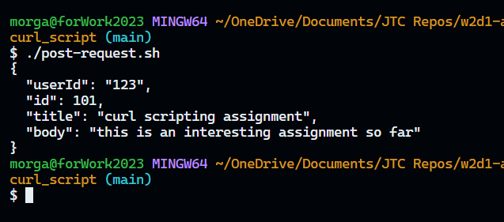
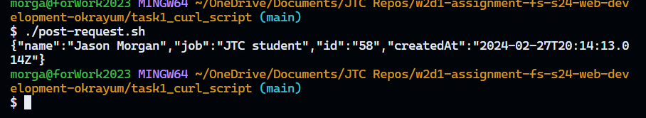

# Task 1: curl Scripting

Curl is a command line tool for doing all sorts of URL manipulations and transfers.

## My Approach

To write the scripts I looked at the example in the curl docs for using POST. Then I checked the endpoints for each mock API.

## Challenges Faced

I couldn't get the script to run at first from the file I created. I tried in powershell, cmd, and VS Code. I then got it to run in cmd and VS Code using the whole script. I looked up getting the script to run in Google and it advised switching to bash in VS Code. That worked for me. I learned curl is simple and easy to use, but to make sure I am using the correct tools on my end to work with it.

## Screenshots

