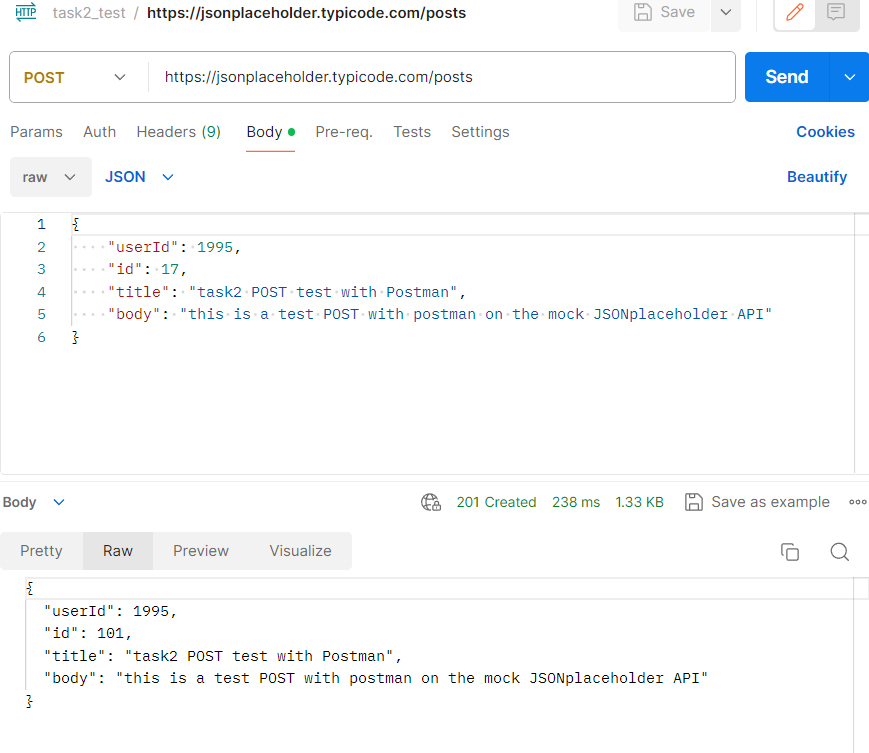

# Task 2: Postman Collection

Postman is an API platform for building and using APIs.

## My Approach

To start off I opened the Postman desktop App. I created a new collection for an HTTP request. Selected POST then copied the url for the mock API and endpoint. I created my test object then pressed send.

## Challenges Faced 

The only challenge I faced was exporting the collection. I finally figured out that I had to save it first. That makes sense.

## Screenshot

