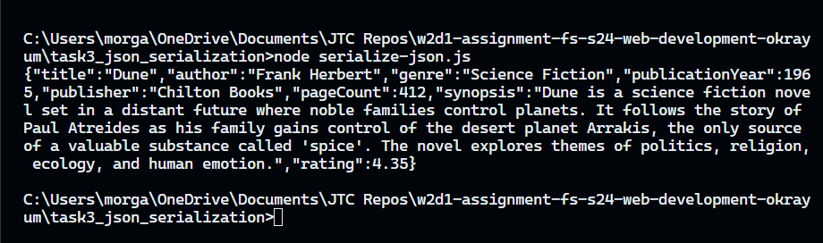

# Task 3: JSON Serialization in JavaScript

JSON (JavaScript Object Notation) serialization converts a JavaScript object into a JSON string.

## My Approach

I created 2 variables. One for the JS object and one for the serialized version. I used JSON.stringify(variable2) to serialze the object into a JSON string.

## Challenges Faced

None.

## Key Learnings

It is very important to learn how JSON serialization/deserialization works because JSON is one of the top formats for data transfer. It's mainly used in web development and API communication.

## Screentshot

