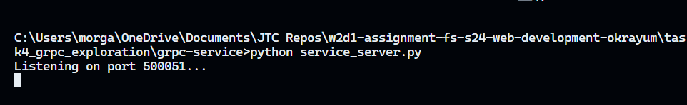
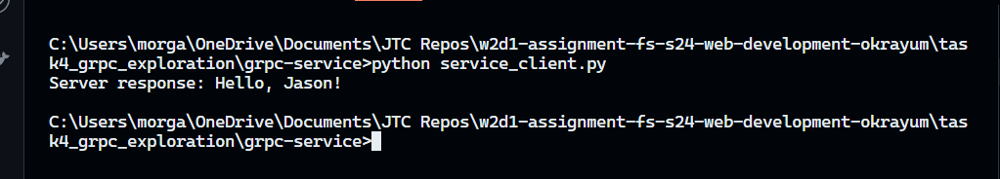

# Task 4: gRPC Exploration

gRPC is a modern open source high performance Remote Procedure Call (RPC) framework that can run in any environment.

## My Approach 

I started by reading the gRPC docs, and the gRPC docs for Node. I set up my service.proto file based on the tutorials in the docs.

## Challenges Faced

I faced many challenges with this. The tutorials in the docs used an already completed repo to complete, but this didn't help me implement it on my own. 

I was trying to us JavaScript which required me to install a few other plugins. I kept getting errors that the plugins were not found when trying to genereate the code with protoc. I read that python needed less extra tools to have code created by the compiler. I got the program to work just fine after switching to python. 

I did use ChatGPT, prompts = Simple server and client set up for gRPC. How to run protoc compiler in VS Code with python vs. JavaScript.

## Key Learnings

I realized that I need to explore gRPC further due to my issues of being able to get it to run with JavaScript. It seems very simple but will also have to learn the syntax.

## Screenshots

